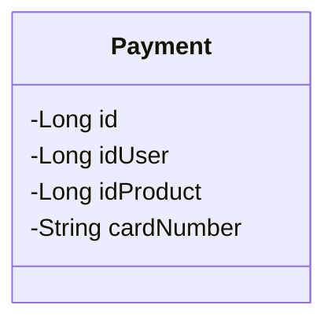

# 🎲 - Apache-Kafka - 📨

- É mais do que uma banco de dados, é um poderoso sistema de <strong>stream de dados</strong>;
- Sistemas enviam informações para o Kafka e outros sistemas leem essa informações, tornando-o, na prática, um <strong>banco de dados</strong>;
- O Kafka não permite <strong>alterações nos dados</strong>;
- Sua função principal é possibilitar a <strong>leitura sequencial das informações</strong>;
- Essa característica única contribui para sua extrema rapidez;

 

## 📋 - Classe:

## ⚙️ - Diagrama:

